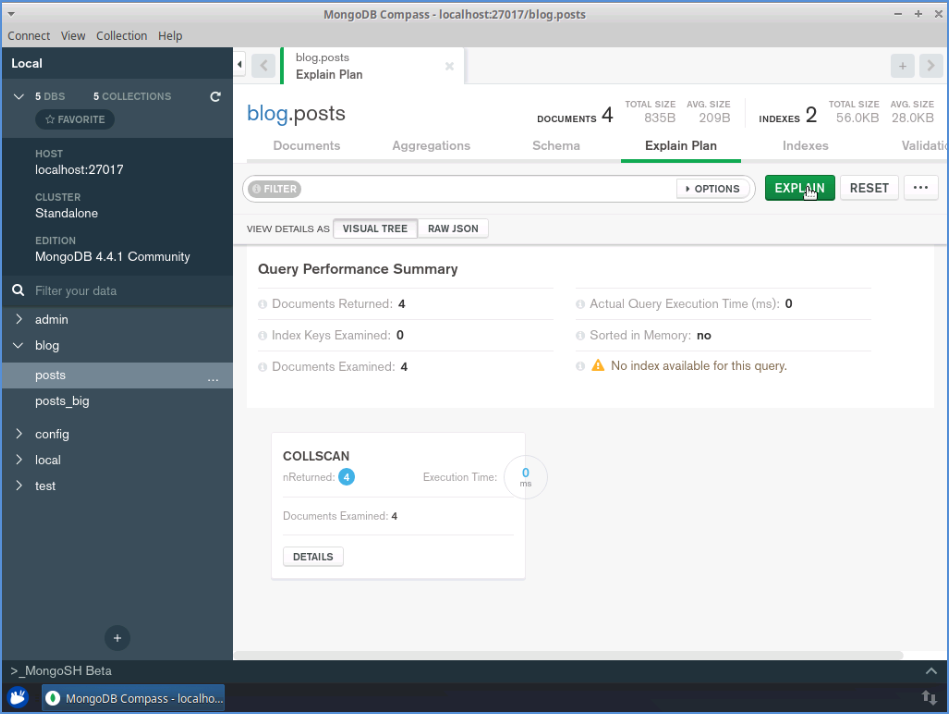

# NoSQL Database with MongoDB and Compass

## Table of Contents

- [Overview](#overview)
  - [The Objectives](#objectives)
  - [The Task](#tasks)
  - [Screenshot](#screenshot)
  - [Link](#Link)
  - [Technical Skills](#technical-skills)
  - [Operating System](#operating-system)
  - [Version Control](#version-control)
  - [Browsers](#browsers)
  - [Acknoledgement](#Acknowledgement)
- [Author](#author)
  - [Connect With Me](#connect-with-me)
  - [Github Stats](#github-stats)

## Overview

### Objectives

Following are the primary objectives of this project.

- Explore a MongoDB instance and its databases
- Create a document
- Query and update documents
- Insert and update multiple documents at once
- Analyze a collection schema using MongoDB Compass
- Understand the power of indexes
- Create unique and 2dsphere indexes

Brushing up NoSQL document databases basics, as well as handling the basic MongoDB commands(such as update, use, show, find(), pretty(), sort(), $exits, $and etc), how to apply simple indexes to the database, and have a working understanding of some of the features of MongoDB Compass, such as schema analysis and query performances.

### Tasks

- **Task 1:** Explore a MongoDB instance and its databases

- **Task 2:** Create a document for a blog posts collection

- **Task 3:** Query and update documents

- **Task 4:** Insert and update multiple documents at once

- **Task 5:** Analyze the blog posts collection schema using MongoDB Compass

- **Task 6:** Understand the power of indexes

- **Task 7:** To generate 5 million random post documents, similar to the ones we created, in a separate collection using **mgodatagen (an executable file which is an open source tool)**

- **Task 7:** Create an unique index and a 2dsphere index for geographical queries

### Screenshot

**Some screenshots of the project**

### Link

- Certificate : [https://www.coursera.org/account/accomplishments/certificate/N8MGW4KDT8YV]

### Technical Skills

 
<kbd></kbd>

### Operating System

 
### Version Control

### Browsers

 

### Acknowledgement

This project is being associated with **Coursera Project Network**. It is been authorized by **Coursera Project Network** and offered by **Coursera**

## Authors

### Connect With Me

 
 

### GitHub Stats

